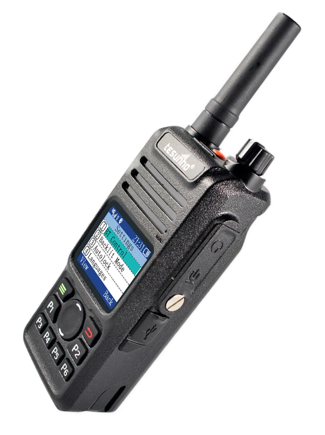
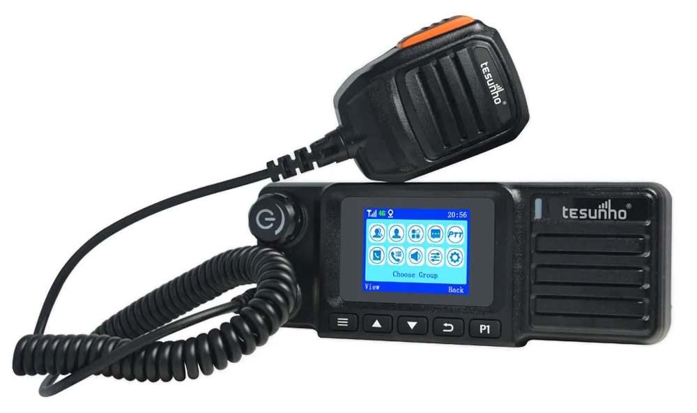

  

  <strong>Azonnali csoportkommunikáció 4G LTE hálózaton.</strong> 
  Stabil. Skálázható. Biztonságos.

  <a href="https://pannonptt.hu"><strong>🌐 Weboldal megtekintése</strong></a> |
  <a href="mailto:hello@pannonptt.hu"><strong>📩 Ajánlatkérés</strong></a>

---

# 🚀 Miért válassza a Pannon PTT rádió rendszerét?

A hagyományos analóg rádiós rendszerek korlátozott hatótávolságúak és költséges infrastruktúrát igényelnek. A biztonság és a zavarvédelem messze elmarad a napjainkban elvárható szinttől.

A **Pannon PTT** 4G LTE hálózaton működő POC (PTT over Cellular) megoldást kínál azonnal:

✔ Országos lefedettség (+teljes EU, adatkártya függő)
✔ Azonnali csoportos információ átvitel 
✔ Diszpécser irányítói funkciók (beszéd+GPS) 
✔ Gyors bevezetés infrastruktúra kiépítése nélkül  

---

# 📈 Üzleti előnyök

### 💰 Költséghatékonyság  
Nincs átjátszó torony, nincs frekvenciaengedély. 
Előre tervezhető fix költségek, amelyek jóval alacsonyabbak a hagyományos, analóg rádiórendszerekhez képest.

### ⚡ Azonnali reagálás  
Egyetlen gombnyomás – a teljes csapat értesítése.
Másodpercen belüli hívásfelépülési idő egész Európában.

### 📊 Skálázhatóság  
Tetszőlegesen bővíthető felhasználói létszám, tetszőleges számú beszédcsatorna.

### 🛡 Biztonságos működés  
Mobiladat alapú, titkosított kommunikáció.
Nem lehallgatható, nem zavarható.

---

# 📻 Professzionális, ipari minőségű készülékek

## Tesunho TH-682  
### Kézi LTE+GPS PoC rádió

  

Ideális:

- Építőipar, mezőgazdaság  
- Biztonsági szolgálatok, polgárőrségek számára  
- Rendezvényekhez  
- Mentéshez, kereséshez 

🔗 https://pannonptt.hu/th682.php

---

## Tesunho TM-991  
### Járműbe szerelhető mobil PoC rádió adóvevő

  

Ajánlott:

- Mezőgazdasági gépekbe  
- Szállítmányozási cégeknek
- TAXI vállalatoknak  
- Fix telepítésű irányító feladatokra 

🔗 https://pannonptt.hu/tm991.php

---

# 🌍 Országos +EU lefedettség – Hatótávolsági korlát nélkül

  

A rendszer mindenhol működik, ahol mobilhálózati lefedettség elérhető.

Nincs többé rádiós holttér.

---

# 📞 Kérjen személyre szabott ajánlatot

  <strong>Gyors konzultáció • Egyedi csomag • Professzionális támogatás</strong>

  <a href="https://pannonptt.hu"><strong>🌐 Weboldal megtekintése</strong></a>

  <a href="mailto:hello@pannonptt.hu"><strong>📩 Ajánlatkérés most</strong></a>

---

  <strong>Pannon PTT</strong> 
  Rádiózzon bárhonnan - bárhová.

